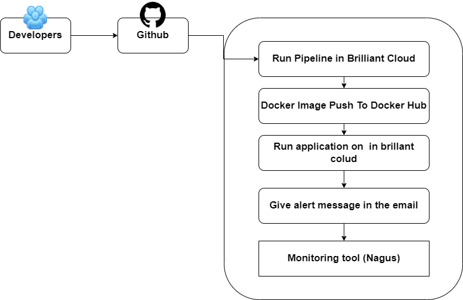

# Continuous Integration Using Jenkins, Nexus, Sonarqube & Slack

## Scenario

- Agile SDLC
- Developers make regular code changes.
- These commits needs to be Build & Tested.
- Usually Build & Release Team will do this job.
- Developers responsibility to merge and integrate code.

## Tools

- CircleCI (CI server)
- Git (Version Control System)
- Eslint (Code analysis tool)
- Email (Notification)
- Docker (Containerization)
- Brilliant Cloud (Compute Resource)

## Objective

Goals

- Auto deploy
- Short MTTR (Minium Time To Repair)
- Fast turn around on feature changes
- Less Disruptive
- High Scalability

## Architecture of CI Pipeline

### Workflow

### Full Architecture

## Flow of execution

1. Login to AWS Account
2. Create key pair
3. Create Security Group
   - Jenkins, Nexus & Sonarqube
4. Create Ec2 Instances with userdata
   - Jenkins, Nexus & Sonarqube
5. Post installation
   - Jenkins setup & plugins
   - Nexus setup & repository setup
   - Sonarqube login test
6. Git
   - Create a github repository & migrate code
   - Integrate github repo with VsCode and test it
   - [Git repository](https://github.com/nizam754/vprociproject)
7. Build job with Nexus integration
8. Github webhook
9. Sonarqube server integration stage
10. Nexus Artifact upload stage
11. Slack Notification
